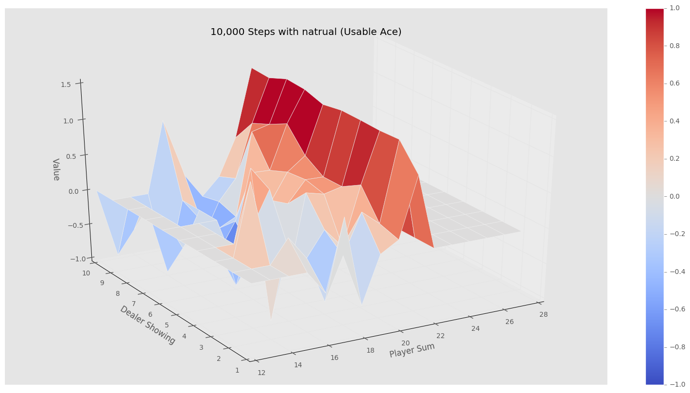
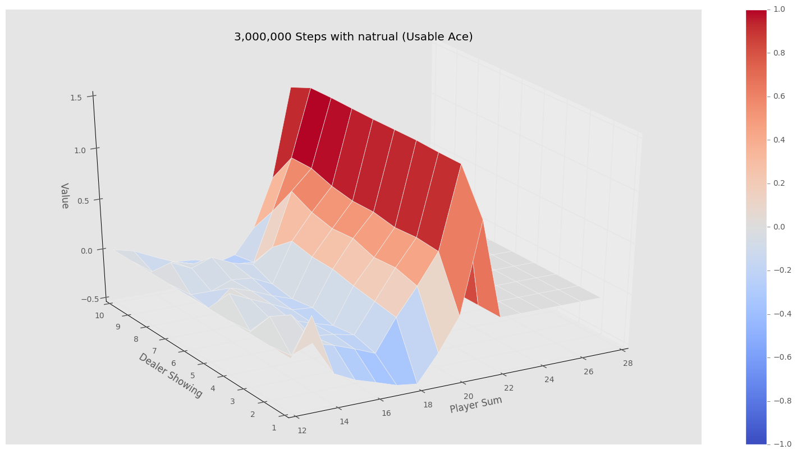
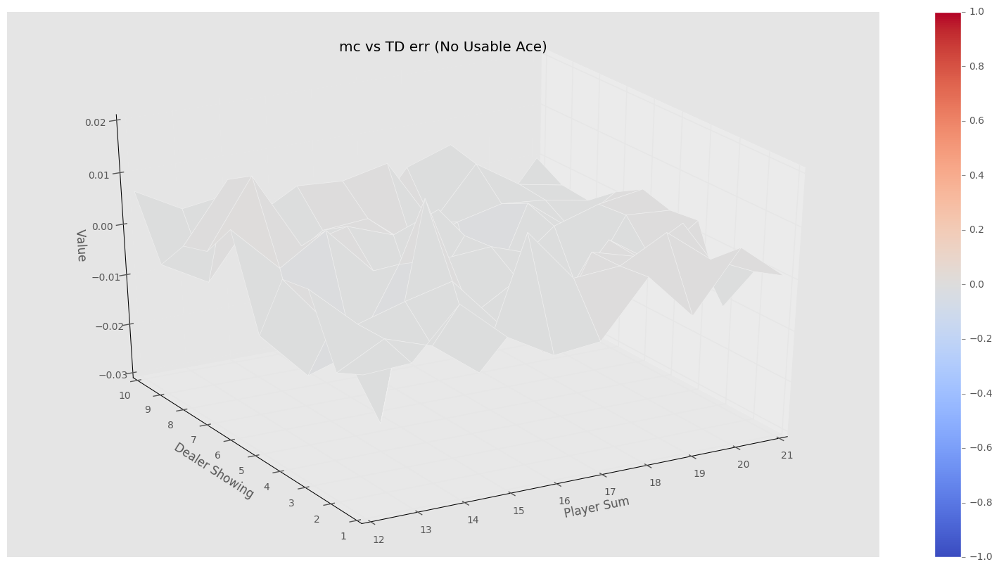
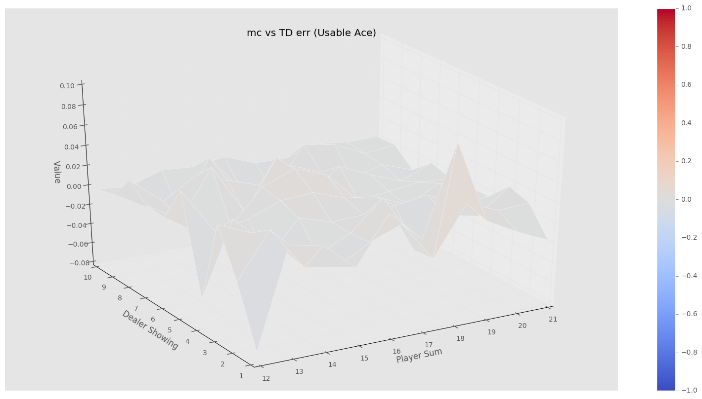

# Model Free Reinforcement Learning 

## Introduction
### Disclaimer
This material act as a supplement to model-free predict([video](https://www.youtube.com/watch?v=PnHCvfgC_ZA&t=707s),[pdf](http://www0.cs.ucl.ac.uk/staff/d.silver/web/Teaching_files/MC-TD.pdf)) and model-free control([video](https://www.youtube.com/watch?v=0g4j2k_Ggc4&t=1636s),[pdf](http://www0.cs.ucl.ac.uk/staff/d.silver/web/Teaching_files/control.pdf)) lectures by David Silver
<br />
you can also find useful RL implementation from [here](https://github.com/dennybritz/reinforcement-learning)

### Why need model free RL?
- Model based RL requires the knowledge of transitions/rewards of all the states, but usually we don't have those knowledge until end of  many trials(episode)

### So how do we solve model free RL?
- one can use Temporal-Difference Learning to solve model free RL 

### What is TD($\lambda$)?
- for now, you can think the TD($\lambda$) cover a varierty of methods, simply by adjusting the paremeter $\lambda$
- The two extreme cases for TD($\lambda$) are TD(1)(a.k.a Monte Carlo) and TD(0) 

### How do we apporach to learn the TD($\lambda$)?
- Introduce the game(BlackJack) that we used to apply RL 
- we first explain Monte-Carlo(MC) method($\lambda$=1) case
    - build the general approach for MC with a fixed policy
    - add in action selection for the MC
    - add in the exploration($\epsilon$-greddy) into the MC
- we next explore the TD(0) case
    - build the general approach for TD(0) with a fixed policy
    - add in action selection for the TD(0)
    - add in the exploration($\epsilon$-greddy) into the TD(0)
- we build the general method to connect TD(0) and Monte-Carlo
    - observe and build the general function from above
    - build the eligibilty function
    - combine the general with eligibity function and build TD($\lambda$)

## BlackJack
you can look at the source code [here](https://github.com/dennybritz/reinforcement-learning/blob/master/lib/envs/blackjack.py), I think Danny has done a very good job in explaining the game. I will just go thru some rules of the game, and the states variable that we will use from the game for the TD($\lambda$)

### Rules:
- two players (i.e dealer, player) on the table
- dealer deal two card to himself and two cards to player, and player can observe the fisrt card from the dealer 
- the cards from the deck has value from 1 to 10 [J,Q,K]==10 
- 1(Ace) can be used either as 1 or 11, depened on strategy
- if any player has a hand of value that is over 21, he is busted, and the game stop
- player can keep ask for more cards(hit) or not(stick) depend on player's strtergy
- if player choose to stick, deal will start to draw cards until hit to 17 or more 
- if player is busted, player has reward of -1. if player and dealer has same score, then reward for player will be 0. Last if player has value greater than the dealer
- if the value of first two cards from player add up to 21, player win a reward of 1.5

### State Variables from BlackJack:
the player can observer the following state variables from the game enviroment
- the total value of his/her cards
- dealer's first card
- reward that player is getting(i.e 0 during the game, 1, -1, 0 or 1.5 at the end of the game)  


```python
import random
not_repeat_deck = [1, 2, 3, 4, 5, 6, 7, 8, 9, 10, 10, 10, 10]
deck = []
for i in range(4): deck += not_repeat_deck

def draw_card(deck = None):
    if not deck: return random.choice(not_repeat_deck)
    else:
        selected_card_idx = random.randrange(0,len(deck)-1,1)
        selected_card = deck[selected_card_idx] 
        new_deck = deck[:selected_card_idx]+deck[selected_card_idx+1:]
        return (new_deck, selected_card)

def draw_hand(deck = None):
        if not deck: return [draw_card(), draw_card()]
        returned_deck, first_card =  draw_card(deck)
        new_deck, second_card = draw_card(returned_deck)
        return (new_deck, [first_card, second_card])
    
def usable_ace(hand):
    return 1 in hand and sum(hand)+10<=21
        

def sum_hand(hand):
    return sum(hand)+10 if usable_ace(hand) else sum(hand) 

def is_busted(hand):
    return sum_hand(hand) > 21

def hand_score(hand):
    return 0 if is_busted(hand) else sum_hand(hand) 

def is_natural(hand):
    return sorted(hand) == [1,10] 

def compare_hand(hand1, hand2):
    return int(hand_score(hand1) > hand_score(hand2)) - int(hand_score(hand2) > hand_score(hand1))


class BlackJack (object):
    def __init__(self, num_deck = None, natural = None):
        self.deck = [] if num_deck else not_repeat_deck
        self.natural = False if not natural else natural   
        self.dealer_policy = 17
        self.actions = [0,1]
        self.reward = None 
        if num_deck: 
            self.deck += deck 
        if not self.deck: 
            self.dealer_cards =  draw_hand()
            self.player_cards =  draw_hand()
        else:
            (self.deck, self.dealer_cards) = draw_hand(self.deck)
            (self.deck, self.player_cards) = draw_hand(self.deck)
            
        while sum_hand(self.player_cards)<12: 
            if num_deck: self.deck, drawd_card = draw_card(self.deck)
            else: drawd_card = draw_card()
            self.player_cards.append(drawd_card)
            
    def start(self):return self._get_observe()
    
    def step(self, action):return self._step(action)
    
    def get_actions(self): return self.actions 
    
    def print_result(self): print ' player hand {}, dealer hand {} , player reward {} \n'.format(self.player_cards,
                                                                                             self.dealer_cards,
                                                                                            self.reward) 
    def _get_observe(self):
        return sum_hand(self.player_cards), self.dealer_cards[0], usable_ace(self.player_cards)
    
    def _step(self, action):
        if action not in self.actions: return lambda x: self._step(x)
        
        if action == 1: 
            self.deck, drawd_card = draw_card(self.deck)
            self.player_cards.append(drawd_card)
            if is_busted(self.player_cards):
                done = True
                reward = -1 
            else: 
                done = False 
                reward = 0 

        elif action == 0:
            while sum_hand(self.dealer_cards) <= self.dealer_policy:
                (self.deck, drawd_card) = draw_card(self.deck)
                self.dealer_cards.append(drawd_card)
            reward = compare_hand(self.player_cards, self.dealer_cards)
            if self.natural and is_natural(self.player_cards) and not is_natural(self.dealer_cards):
                reward = 1.5
            done = True

        self.reward = reward
        return self._get_observe(), reward, done
    
    
    
def black_jack_stratergy(score, actions, target):
    if len(actions) == 0: return actions 
    return actions[1] if score<=target else actions[0] 
    
    
    
for epi in range(200):
    game = BlackJack(2)
    observ_state = game.start()
    (player_score, dealer_showed_card, can_use_ace) = observ_state
    action = black_jack_stratergy(player_score, [0, 1], 19) # player's stratergy, such always hit unless greater or eq to 19 
    done = False
    while not done:
        observ_state, reward, done = game.step(action)
        (player_score, dealer_showed_card, can_use_ace) = observ_state
        action = black_jack_stratergy(player_score, [0, 1], 19)
    game.print_result()

```

     player hand [10, 9, 10], dealer hand [10, 6] , player reward -1 
    
     player hand [2, 6, 10, 4], dealer hand [10, 10] , player reward -1 
    
     player hand [10, 10], dealer hand [10, 1] , player reward -1 
    
     player hand [5, 6, 2, 4, 5], dealer hand [10, 10] , player reward -1 
    
     player hand [10, 6, 10], dealer hand [10, 4] , player reward -1 
    
     player hand [7, 1, 3], dealer hand [10, 4, 9] , player reward 1 
    
     player hand [10, 2, 10], dealer hand [1, 10] , player reward -1 
    
     player hand [10, 6, 6], dealer hand [10, 10] , player reward -1 
    
     player hand [5, 10, 7], dealer hand [6, 4] , player reward -1 
    
     player hand [10, 1], dealer hand [4, 10, 3, 8] , player reward 1 
    
     player hand [1, 9], dealer hand [10, 2, 10] , player reward 1 
    
     player hand [9, 3, 2, 7], dealer hand [10, 3, 10] , player reward 1 
    
     player hand [10, 10], dealer hand [6, 6, 2, 8] , player reward 1 
    
     player hand [3, 10, 10], dealer hand [1, 8] , player reward -1 
    
     player hand [10, 9, 10], dealer hand [2, 5] , player reward -1 
    
     player hand [10, 3, 10], dealer hand [7, 9] , player reward -1 
    
     player hand [10, 4, 10], dealer hand [5, 2] , player reward -1 
    
     player hand [10, 10], dealer hand [10, 10] , player reward 0 
    
     player hand [1, 8, 10, 8], dealer hand [10, 6] , player reward -1 
    
     player hand [6, 8, 3, 8], dealer hand [9, 3] , player reward -1 
    
     player hand [4, 4, 10, 4], dealer hand [5, 6] , player reward -1 
    
     player hand [5, 10, 6], dealer hand [10, 1] , player reward 0 
    
     player hand [10, 6, 10], dealer hand [1, 8] , player reward -1 
    
     player hand [9, 10, 3], dealer hand [6, 6] , player reward -1 
    
     player hand [3, 10, 2, 4, 3], dealer hand [3, 10] , player reward -1 
    
     player hand [10, 10], dealer hand [10, 1] , player reward -1 
    
     player hand [10, 1], dealer hand [10, 5, 7] , player reward 1 
    
     player hand [10, 1], dealer hand [8, 1] , player reward 1 
    
     player hand [10, 9, 9], dealer hand [5, 5] , player reward -1 
    
     player hand [6, 7, 6, 10], dealer hand [6, 10] , player reward -1 
    
     player hand [10, 10], dealer hand [1, 9] , player reward 0 
    
     player hand [9, 10, 2], dealer hand [8, 8, 5] , player reward 0 
    
     player hand [10, 8, 10], dealer hand [2, 10] , player reward -1 
    
     player hand [5, 2, 3, 9, 5], dealer hand [4, 10] , player reward -1 
    
     player hand [10, 6, 9], dealer hand [10, 10] , player reward -1 
    
     player hand [7, 7, 1, 1, 6], dealer hand [9, 5] , player reward -1 
    
     player hand [5, 10, 8], dealer hand [4, 3] , player reward -1 
    
     player hand [10, 9, 5], dealer hand [10, 10] , player reward -1 
    
     player hand [1, 3, 10, 1, 7], dealer hand [10, 6] , player reward -1 
    
     player hand [2, 4, 9, 10], dealer hand [9, 7] , player reward -1 
    
     player hand [10, 7, 8], dealer hand [4, 2] , player reward -1 
    
     player hand [1, 10], dealer hand [10, 7, 10] , player reward 1 
    
     player hand [1, 5, 10, 3, 3], dealer hand [1, 4] , player reward -1 
    
     player hand [3, 10, 3, 5], dealer hand [10, 10] , player reward 1 
    
     player hand [1, 10], dealer hand [3, 10, 1, 9] , player reward 1 
    
     player hand [3, 8, 10], dealer hand [3, 8, 10] , player reward 0 
    
     player hand [2, 7, 10, 10], dealer hand [4, 8] , player reward -1 
    
     player hand [10, 8, 10], dealer hand [9, 4] , player reward -1 
    
     player hand [5, 10, 6], dealer hand [7, 6, 10] , player reward 1 
    
     player hand [4, 5, 3, 9], dealer hand [9, 7, 4] , player reward 1 
    
     player hand [10, 1], dealer hand [1, 1, 10, 3, 10] , player reward 1 
    
     player hand [10, 4, 9], dealer hand [10, 7] , player reward -1 
    
     player hand [10, 8, 10], dealer hand [1, 10] , player reward -1 
    
     player hand [6, 10, 7], dealer hand [3, 7] , player reward -1 
    
     player hand [3, 10, 10], dealer hand [3, 6] , player reward -1 
    
     player hand [2, 10, 2, 10], dealer hand [5, 10] , player reward -1 
    
     player hand [4, 10, 10], dealer hand [2, 1] , player reward -1 
    
     player hand [5, 10, 5], dealer hand [3, 6, 7, 9] , player reward 1 
    
     player hand [10, 10], dealer hand [3, 5, 10] , player reward 1 
    
     player hand [10, 7, 7], dealer hand [4, 10] , player reward -1 
    
     player hand [10, 10], dealer hand [9, 1] , player reward 0 
    
     player hand [9, 6, 4, 9], dealer hand [3, 10] , player reward -1 
    
     player hand [1, 10], dealer hand [5, 5, 10] , player reward 1 
    
     player hand [8, 10, 3], dealer hand [9, 1] , player reward 1 
    
     player hand [10, 8, 3], dealer hand [10, 10] , player reward 1 
    
     player hand [2, 10, 8], dealer hand [2, 5, 4, 6, 9] , player reward 1 
    
     player hand [9, 1], dealer hand [5, 10, 10] , player reward 1 
    
     player hand [9, 10, 9], dealer hand [1, 10] , player reward -1 
    
     player hand [6, 10, 9], dealer hand [2, 4] , player reward -1 
    
     player hand [4, 4, 7, 9], dealer hand [10, 4] , player reward -1 
    
     player hand [10, 3, 3, 2, 9], dealer hand [4, 7] , player reward -1 
    
     player hand [5, 7, 3, 10], dealer hand [1, 7] , player reward -1 
    
     player hand [1, 5, 10, 9], dealer hand [6, 5] , player reward -1 
    
     player hand [3, 10, 4, 7], dealer hand [1, 8] , player reward -1 
    
     player hand [1, 3, 6], dealer hand [10, 9] , player reward 1 
    
     player hand [6, 10, 7], dealer hand [10, 9] , player reward -1 
    
     player hand [9, 4, 10], dealer hand [10, 7] , player reward -1 
    
     player hand [7, 10, 10], dealer hand [10, 4] , player reward -1 
    
     player hand [1, 9], dealer hand [6, 6, 3, 8] , player reward 1 
    
     player hand [7, 6, 4, 10], dealer hand [6, 2] , player reward -1 
    
     player hand [6, 2, 1, 2], dealer hand [4, 3, 3, 10] , player reward 1 
    
     player hand [10, 1], dealer hand [9, 9] , player reward 1 
    
     player hand [3, 9, 4, 10], dealer hand [10, 10] , player reward -1 
    
     player hand [5, 1, 10, 4], dealer hand [6, 3, 9] , player reward 1 
    
     player hand [10, 6, 5], dealer hand [7, 7, 10] , player reward 1 
    
     player hand [10, 6, 1, 6], dealer hand [10, 7] , player reward -1 
    
     player hand [2, 7, 10, 10], dealer hand [9, 8] , player reward -1 
    
     player hand [4, 10, 2, 7], dealer hand [10, 10] , player reward -1 
    
     player hand [10, 10], dealer hand [10, 3, 8] , player reward -1 
    
     player hand [7, 10, 6], dealer hand [4, 7] , player reward -1 
    
     player hand [8, 2, 5, 8], dealer hand [10, 5] , player reward -1 
    
     player hand [2, 8, 7, 10], dealer hand [7, 3] , player reward -1 
    
     player hand [10, 7, 1, 4], dealer hand [10, 10] , player reward -1 
    
     player hand [10, 10], dealer hand [6, 2, 10] , player reward 1 
    
     player hand [10, 9, 3], dealer hand [1, 2] , player reward -1 
    
     player hand [10, 6, 1, 5], dealer hand [9, 6] , player reward -1 
    
     player hand [7, 6, 10], dealer hand [5, 3] , player reward -1 
    
     player hand [10, 7, 1, 8], dealer hand [9, 2] , player reward -1 
    
     player hand [10, 10], dealer hand [5, 8, 2, 3] , player reward 1 
    
     player hand [1, 10], dealer hand [10, 9] , player reward 1 
    
     player hand [6, 2, 7, 10], dealer hand [4, 2] , player reward -1 
    
     player hand [6, 9, 5], dealer hand [7, 2, 10] , player reward 1 
    
     player hand [10, 1], dealer hand [9, 4, 1, 4] , player reward 1 
    
     player hand [3, 10, 9], dealer hand [2, 3] , player reward -1 
    
     player hand [8, 10, 10], dealer hand [2, 2] , player reward -1 
    
     player hand [10, 10], dealer hand [10, 1] , player reward -1 
    
     player hand [8, 10, 10], dealer hand [3, 7] , player reward -1 
    
     player hand [7, 7, 6], dealer hand [10, 9] , player reward 1 
    
     player hand [10, 1], dealer hand [8, 1] , player reward 1 
    
     player hand [10, 10], dealer hand [6, 8, 10] , player reward 1 
    
     player hand [10, 10], dealer hand [3, 3, 4, 6, 8] , player reward 1 
    
     player hand [7, 10, 8], dealer hand [1, 5] , player reward -1 
    
     player hand [5, 10, 10], dealer hand [5, 2] , player reward -1 
    
     player hand [9, 4, 5, 10], dealer hand [9, 8] , player reward -1 
    
     player hand [6, 10, 1, 7], dealer hand [10, 6] , player reward -1 
    
     player hand [10, 5, 7], dealer hand [10, 6] , player reward -1 
    
     player hand [4, 3, 10, 6], dealer hand [10, 1] , player reward -1 
    
     player hand [10, 4, 1, 3, 2], dealer hand [9, 3, 6] , player reward 1 
    
     player hand [1, 7, 8, 8], dealer hand [9, 4] , player reward -1 
    
     player hand [5, 2, 6, 7], dealer hand [1, 6, 10, 5] , player reward 1 
    
     player hand [10, 9, 3], dealer hand [2, 8] , player reward -1 
    
     player hand [3, 6, 7, 8], dealer hand [10, 10] , player reward -1 
    
     player hand [5, 2, 9, 10], dealer hand [10, 5] , player reward -1 
    
     player hand [3, 10, 10], dealer hand [10, 8] , player reward -1 
    
     player hand [7, 4, 3, 3, 10], dealer hand [10, 10] , player reward -1 
    
     player hand [10, 5, 2, 1, 1, 5], dealer hand [3, 4] , player reward -1 
    
     player hand [3, 6, 4, 6, 9], dealer hand [8, 8] , player reward -1 
    
     player hand [10, 8, 10], dealer hand [6, 9] , player reward -1 
    
     player hand [5, 7, 8], dealer hand [5, 1, 10, 10] , player reward 1 
    
     player hand [3, 8, 6, 9], dealer hand [10, 5] , player reward -1 
    
     player hand [4, 7, 10], dealer hand [7, 8, 8] , player reward 1 
    
     player hand [8, 1, 10, 7], dealer hand [1, 10] , player reward -1 
    
     player hand [10, 5, 5], dealer hand [5, 1, 10, 4] , player reward 0 
    
     player hand [5, 10, 2, 10], dealer hand [7, 9] , player reward -1 
    
     player hand [2, 1, 1, 6], dealer hand [7, 4, 10] , player reward -1 
    
     player hand [9, 7, 10], dealer hand [5, 9] , player reward -1 
    
     player hand [5, 4, 10, 10], dealer hand [4, 2] , player reward -1 
    
     player hand [2, 10, 5, 10], dealer hand [1, 1] , player reward -1 
    
     player hand [10, 2, 6, 10], dealer hand [10, 6] , player reward -1 
    
     player hand [10, 5, 6], dealer hand [10, 10] , player reward 1 
    
     player hand [9, 10, 2], dealer hand [1, 2, 10, 4, 5] , player reward 1 
    
     player hand [10, 5, 10], dealer hand [1, 6] , player reward -1 
    
     player hand [10, 2, 6, 3], dealer hand [10, 10] , player reward 1 
    
     player hand [2, 1, 1, 9, 6, 10], dealer hand [8, 6] , player reward -1 
    
     player hand [1, 10], dealer hand [8, 7, 3] , player reward 1 
    
     player hand [10, 7, 10], dealer hand [7, 8] , player reward -1 
    
     player hand [10, 10], dealer hand [6, 10, 1, 10] , player reward 1 
    
     player hand [7, 4, 9], dealer hand [5, 3, 7, 10] , player reward 1 
    
     player hand [3, 1, 4, 7, 10], dealer hand [2, 8] , player reward -1 
    
     player hand [8, 7, 10], dealer hand [10, 10] , player reward -1 
    
     player hand [9, 10, 5], dealer hand [8, 9] , player reward -1 
    
     player hand [10, 10], dealer hand [4, 10, 7] , player reward -1 
    
     player hand [7, 1, 10, 7], dealer hand [5, 6] , player reward -1 
    
     player hand [10, 10], dealer hand [7, 4, 10] , player reward -1 
    
     player hand [9, 10, 3], dealer hand [7, 5] , player reward -1 
    
     player hand [1, 2, 3, 10, 1, 10], dealer hand [2, 8] , player reward -1 
    
     player hand [10, 5, 7], dealer hand [6, 2] , player reward -1 
    
     player hand [4, 6, 10], dealer hand [4, 1, 8, 6] , player reward 1 
    
     player hand [7, 3, 7, 4], dealer hand [8, 10] , player reward 1 
    
     player hand [4, 9, 9], dealer hand [2, 9] , player reward -1 
    
     player hand [6, 1, 1, 7, 5], dealer hand [4, 8, 3, 5] , player reward 0 
    
     player hand [10, 10], dealer hand [3, 9, 9] , player reward -1 
    
     player hand [3, 6, 10, 10], dealer hand [1, 5] , player reward -1 
    
     player hand [7, 10, 4], dealer hand [8, 10] , player reward 1 
    
     player hand [6, 10, 10], dealer hand [8, 3] , player reward -1 
    
     player hand [1, 10], dealer hand [10, 9] , player reward 1 
    
     player hand [9, 8, 4], dealer hand [8, 9, 3] , player reward 1 
    
     player hand [1, 10], dealer hand [6, 2, 7, 4] , player reward 1 
    
     player hand [10, 10], dealer hand [2, 10, 10] , player reward 1 
    
     player hand [7, 8, 9], dealer hand [8, 7] , player reward -1 
    
     player hand [3, 10, 6, 10], dealer hand [1, 4] , player reward -1 
    
     player hand [7, 10, 2, 5], dealer hand [8, 8] , player reward -1 
    
     player hand [3, 1, 8, 7, 5], dealer hand [10, 3] , player reward -1 
    
     player hand [10, 8, 3], dealer hand [10, 10] , player reward 1 
    
     player hand [10, 9, 10], dealer hand [5, 10] , player reward -1 
    
     player hand [2, 1, 1, 7], dealer hand [1, 3, 6] , player reward 1 
    
     player hand [10, 6, 8], dealer hand [10, 7] , player reward -1 
    
     player hand [2, 10, 4, 9], dealer hand [3, 10] , player reward -1 
    
     player hand [2, 10, 8], dealer hand [4, 6, 10] , player reward 0 
    
     player hand [10, 4, 4, 6], dealer hand [10, 6] , player reward -1 
    
     player hand [10, 8, 3], dealer hand [9, 8, 1] , player reward 1 
    
     player hand [7, 10, 1, 8], dealer hand [6, 10] , player reward -1 
    
     player hand [8, 3, 2, 8], dealer hand [4, 6, 7, 8] , player reward 1 
    
     player hand [8, 1, 5, 8], dealer hand [10, 3] , player reward -1 
    
     player hand [5, 10, 3, 3], dealer hand [2, 10, 6] , player reward 1 
    
     player hand [7, 4, 7, 6], dealer hand [8, 10] , player reward -1 
    
     player hand [10, 10], dealer hand [9, 5, 6] , player reward 0 
    
     player hand [9, 9, 5], dealer hand [4, 2] , player reward -1 
    
     player hand [10, 10], dealer hand [4, 1, 2, 8, 7] , player reward 1 
    
     player hand [8, 9, 4], dealer hand [5, 6, 10] , player reward 0 
    
     player hand [2, 5, 1, 9, 5], dealer hand [1, 10] , player reward -1 
    
     player hand [5, 9, 7], dealer hand [7, 10, 9] , player reward 1 
    
     player hand [7, 5, 10], dealer hand [10, 9] , player reward -1 
    
     player hand [8, 2, 5, 9], dealer hand [10, 10] , player reward -1 
    
     player hand [2, 10, 10], dealer hand [5, 5] , player reward -1 
    
     player hand [2, 5, 4, 10], dealer hand [5, 3, 10] , player reward 1 
    
     player hand [10, 10], dealer hand [8, 10] , player reward 1 
    
     player hand [10, 2, 5, 3], dealer hand [5, 10, 10] , player reward 1 
    
     player hand [9, 4, 5, 5], dealer hand [5, 9] , player reward -1 
    
     player hand [1, 8, 2], dealer hand [5, 9, 7] , player reward 0 
    


## Monte-Carlo Method 


```python
import copy
import matplotlib
from collections import defaultdict
import plotting
matplotlib.style.use('ggplot')

def black_jack_stratergy_MC(state, actions, target):
    score = state[0]
    if len(actions) == 0: return actions 
    return actions[1] if score<=target else actions[0] 
        
"""
add state into current episode if state not in the states_set,
increment the counter for such state depend on type of 
policy(e.g:first vist VS every visit)
"""
def add_state_to_episode_and_counter(state, states_set, dic, flag = 0):
    if state not in states_set or flag == 1: dic[state] += 1 # increment the counter when it fisrt encounter in the
                                                             # states_set(first visit) or the flag is one(every visit)
    if state not in states_set:
        states_set.add(state)
    return (states_set,dic)
        
class ModelFreeMonteCarolEvaluation(object):
    def __init__(self,
                 iteration,
                 discount,
                 simulation, 
                 default_policy, 
                 learning_rate = None,
                 default_policy_function = black_jack_stratergy_MC
                ):
        self.simulation = simulation
        self.iteration = iteration
        self.policy = default_policy
        self.policy_function = default_policy_function
        self.learning_rate = learning_rate
        self.states_value = defaultdict(float)
        self.states_count = defaultdict(int)
    
    
    def start_MC_predict(self):
        states_value, states_count = copy.deepcopy(self.states_value), copy.deepcopy(self.states_count)
        while self.iteration > 0:
            parameters = self._generate_parameters_from_black_jack()
            states_value = self._MC_predict(parameters, states_value, states_count)
        return states_value
    
            
    def _generate_parameters_from_black_jack(self):
        game = self.simulation(2, True)
        observed_state = game.start()
        (player_score, dealer_showed_card, can_use_ace) = observed_state
        self.iteration -= 1
        done = False
        parametes = (game, observed_state, done)
        return parametes

        
    def _MC_predict(self, sim_parameters, states_value, states_count):
        (sim, observed_state, done) = sim_parameters
        episode_states = set()
        while not done:
            available_actions = sim.get_actions()
            selected_action = self.policy_function(observed_state, available_actions, self.policy)         
            observed_state, reward, done = sim.step(selected_action)
            episode_states, self.states_count = add_state_to_episode_and_counter(observed_state, episode_states, states_count)         
        return self._MC_update(episode_states, reward, states_value, states_count)
    
    
    def _MC_update(self, states_set, reward, states_value, states_count):
        for state in states_set:
            learning_rate = self.learning_rate if self.learning_rate else 1.0/states_count[state]
            states_value[state] += learning_rate*(reward - states_value[state]) 
        return states_value

    
black_jack_MC1 = ModelFreeMonteCarolEvaluation(10000, 1, BlackJack, 17)
res1 = black_jack_MC1.start_MC_predict()   
black_jack_MC2 = ModelFreeMonteCarolEvaluation(3000000, 1, BlackJack, 17)
res2 = black_jack_MC2.start_MC_predict()


plotting.plot_value_function(res1, title="10,000 Steps with natrual")
plotting.plot_value_function(res2, title="3,000,000 Steps with natrual")


```

    /usr/local/lib/python2.7/site-packages/matplotlib/font_manager.py:273: UserWarning: Matplotlib is building the font cache using fc-list. This may take a moment.
      warnings.warn('Matplotlib is building the font cache using fc-list. This may take a moment.')








## Monte-Carlo with $\epsilon$-greedy


```python
import random
import operator
import bisect 
from collections import defaultdict

def epislon_greedy_select_action_from_actions(exploration_rate, state, available_actions, states_actions_value): 
    num_actions = len(available_actions)
    if state not in states_actions_value: return random.randrange(0,num_actions, 1)
    opt_action_idx = max(states_actions_value[state].iteritems(), key=operator.itemgetter(1))[0]
    action_prob = float(exploration_rate)/num_actions
    cumulative = 0 
    actions_prob_ary = []
    for i in range(num_actions):
        if i == opt_action_idx:
            cumulative += 1 - exploration_rate
        cumulative += action_prob
        actions_prob_ary.append(cumulative)
    random_num = random.random() 
    return bisect.bisect(actions_prob_ary,random_num)

def start_black_jack_simulation():
        sim = BlackJack(2, True)
        observed_state = sim.start()
        available_actions = sim.get_actions()
        done = False
        parameters = (sim, observed_state, done, available_actions)
        return parameters 

class ModelFreeMonteCarolControl(object):
    def __init__(self, iteration, simulation = start_black_jack_simulation, learning_rate = None, exploration_rate = 0.1):
        self.iteration = iteration
        self.simulation = simulation
        self.learning_rate = learning_rate
        self.states_actions_value = {}
        self.states_actions_count = {}
        self.exploration_rate = exploration_rate
    
    def start(self):
        states_actions_value = self.states_actions_value 
        states_actions_count = self.states_actions_count
        while 0 <= self.iteration:
            states_actions_set = set()
            (current_epo, observed_state, done, available_actions) = self.simulation()
            selected_action_idx = epislon_greedy_select_action_from_actions(self.exploration_rate,
                                                                            observed_state,
                                                                            available_actions,
                                                                            states_actions_value)
            action = available_actions[selected_action_idx]
            states_actions_value = self._simulate_states_action_from_current_epo(current_epo,
                                                                                 observed_state,
                                                                                 action,done,
                                                                                 states_actions_set,
                                                                                 states_actions_value,
                                                                                 states_actions_count)
            self.iteration -= 1
        return states_actions_value
    

    

    
    def _simulate_states_action_from_current_epo(self, sim, 
                                                 observed_state, 
                                                 action,done,
                                                 states_actions_set,
                                                 states_actions_value, 
                                                 states_actions_count):
        while not done:
            states_actions_set.add((observed_state,action))
            observed_state, reward, done = sim.step(action)
            available_actions = sim.get_actions()
            selected_action_idx = epislon_greedy_select_action_from_actions(self.exploration_rate,
                                                                            observed_state,
                                                                            available_actions,
                                                                            states_actions_value)
            action = available_actions[selected_action_idx]
        return self._update_states_action_from_current_epo(reward, 
                                                          states_actions_set,
                                                          states_actions_value,
                                                          states_actions_count)
    
    def _update_states_action_from_current_epo(self,
                                               reward, 
                                               states_actions_set,
                                               states_actions_value, 
                                               states_actions_count):

        for (observed_state, action) in states_actions_set:
            if observed_state not in states_actions_value and observed_state not in states_actions_count:
                states_actions_count[observed_state] = defaultdict(int) 
                states_actions_value[observed_state] = defaultdict(float)
            states_actions_count[observed_state][action] += 1
            learning_rate = self.learning_rate if self.learning_rate else 1.0/states_actions_count[observed_state][action]
            states_actions_value[observed_state][action] += learning_rate*(reward - states_actions_value[observed_state][action]) 
        return states_actions_value

res1 = ModelFreeMonteCarolControl(5000000)
res1 = res1.start()
v = {}
for itm in res1.items():
    key, val = itm
    value = max(val.iteritems(), key=operator.itemgetter(1))[1]
    v[key] = value 
plotting.plot_value_function(v, title="Optimal Value Function")

```


### SARSA($\lambda$)


```python
from collections import defaultdict 
import operator 
import bisect

class ModelFreeControl(object):
    def __init__(self, iteration, lambda_val=1, discount_rate = 1 , learning_rate = 1, simulation = start_black_jack_simulation, exploration_rate = 0.1):
        self.iteration = iteration
        self.simulation = simulation
        self.discount_rate = discount_rate
        self.learning_rate = learning_rate
        self.states_actions_count = {}
        self.states_actions_value = {}
        self.lambda_val = lambda_val
        self.exploration_rate = exploration_rate
    
    def start_SARSA(self):
        states_actions_value = self.states_actions_value 
        states_actions_count = self.states_actions_count
        while 0 <= self.iteration:
            (current_epo, observed_state, done, available_actions) = start_black_jack_simulation()
            selected_action_idx = epislon_greedy_select_action_from_actions(self.exploration_rate,
                                                                            observed_state,
                                                                            available_actions,
                                                                            states_actions_value)            
            action = available_actions[selected_action_idx]
            states_actions_value = self._SARSA_simulate_states_action_from_current_epo(current_epo,
                                                                                       observed_state,
                                                                                       action,done,
                                                                                       states_actions_value,
                                                                                       states_actions_count)
            self.iteration -= 1
        return states_actions_value
    
    def start_Q_learning(self):
        states_actions_value = self.states_actions_value 
        states_actions_count = self.states_actions_count
        while 0 <= self.iteration:
            (current_epo, observed_state, done, available_actions) = start_black_jack_simulation()
            states_actions_value = self._Q_learning_simulate_states_action_from_current_epo(current_epo,
                                                                                            observed_state,
                                                                                            available_actions,
                                                                                            done,
                                                                                            states_actions_value,
                                                                                            states_actions_count)
            self.iteration -= 1
        return states_actions_value
            
    
    
    # on policy learning (Q(S, A) ← Q(S, A) + α(R + γQ(S′, A′) − Q(S, A)) <-> SARSA), Learn about policy π from experience sampled from π
    # two type SARSA: 
    # 1. not use eligibility trace-> within a episode, each time step(state) update only the Q value(state-action value) of current time step(state)  
    # 2. use eligibility trace-> within a episode, each time step(state) update the current Q value, and the previous time steps' Q value using eligibility trace
    def _SARSA_simulate_states_action_from_current_epo(self,sim,
                                                 observed_state,
                                                 action,done,
                                                 states_actions_value, # Q(S,A) state-action value
                                                 states_actions_count, # inverse of learning rate, decay over time 
                                                 backward_update = True):
        # use elibigility trace
        if backward_update: state_action_elgb = defaultdict(float)
        new_states_actions_value = {}
        while not done:
            if observed_state not in states_actions_value: 
                states_actions_value[observed_state] = {}
            if observed_state not in states_actions_count: 
                states_actions_count[observed_state] = {}
            if action not in states_actions_value[observed_state]:
                states_actions_value[observed_state][action] = 0
            if action not in states_actions_count[observed_state]:
                states_actions_count[observed_state][action] = 0
            
            states_actions_count[observed_state][action] += 1
            
            # E_t(s,a)=γλE_(t−1)(s,a)+1(S_t =s,A_t =a)
            # the state_action_elgb[(observed_state,action)] has mutiply γ and λ during last time step 
            if backward_update: state_action_elgb[(observed_state,action)] += 1

            nx_observed_state, reward, done = sim.step(action)
            
            # not terminate state, next state is avaliable 
            if not done:
                nx_available_actions = sim.get_actions() 
                selected_nx_action_idx = epislon_greedy_select_action_from_actions(self.exploration_rate,
                                                                                    nx_observed_state,
                                                                                    nx_available_actions,
                                                                                    states_actions_value)
                nx_action = nx_available_actions[selected_nx_action_idx]
                
                # initialize value and count for next state that observed, and the next state's action 
                if nx_observed_state not in states_actions_value: 
                    states_actions_value[nx_observed_state] = {}
                if nx_action not in states_actions_value[nx_observed_state]: 
                    states_actions_value[nx_observed_state][nx_action] = 0
                    
            # if there is no next state, the simulation terminate, therefore no more reward
            Q_next_state_next_action = 0 if done else states_actions_value[nx_observed_state][nx_action]     
            delta = reward+self.discount_rate*Q_next_state_next_action-states_actions_value[observed_state][action]           
            
            # use elibigility trace
            if backward_update:
                for state_action, eligbility in state_action_elgb.items():
                    (state, action) = state_action
                    if state not in new_states_actions_value:new_states_actions_value[state] = defaultdict(float)
                    new_states_actions_value[state][action] =states_actions_value[state][action]+1.0/states_actions_count[state][action]*delta*eligbility
                    state_action_elgb[state_action] = self.discount_rate*self.lambda_val*eligbility
            
            # not use elibigility trace
            else:
                if observed_state not in new_states_actions_value:new_states_actions_value[observed_state] = defaultdict(float)
                new_states_actions_value[observed_state][action] = states_actions_value[observed_state][action]+1.0/states_actions_count[observed_state][action]*delta

            # update online(update the state_action_value at each time step within episode) 
            for state, action_val in new_states_actions_value.items():
                for action, val in action_val.items():
                    states_actions_value[state][action] = val
            
            if not done:
                observed_state,action = nx_observed_state, nx_action

        return states_actions_value
    
    # off policy learning (Q(S,A)← Q(S,A)+α (R+γ maxQ(S′,a′)−Q(S,A))),Learn about policy π from experience sampled from μ(previous exp)
    def _Q_learning_simulate_states_action_from_current_epo(self,sim,
                                                            observed_state,
                                                            available_actions,
                                                            done,
                                                            states_actions_value, 
                                                            states_actions_count):
        
        while not done:
            
            selected_action_idx = epislon_greedy_select_action_from_actions(self.exploration_rate,
                                                                            observed_state,
                                                                            available_actions,
                                                                            states_actions_value)
            
            
            action = available_actions[selected_action_idx]
            
            if observed_state not in states_actions_value: 
                states_actions_value[observed_state] = {}
            if observed_state not in states_actions_count: 
                states_actions_count[observed_state] = {}
            if action not in states_actions_value[observed_state]:
                states_actions_value[observed_state][action] = 0
            if action not in states_actions_count[observed_state]:
                states_actions_count[observed_state][action] = 0

            states_actions_count[observed_state][action] += 1
            nx_observed_state, reward, done = sim.step(action)
            
            if not done:
                if nx_observed_state not in states_actions_value: max_nx_observed_state = 0
                # use the max next state-action value, look up the value from the states-actions dictionay 
                else: max_nx_observed_state = max(states_actions_value[nx_observed_state].items(), key = operator.itemgetter(1))[1]
            
            # if there is no next state, the simulation terminate, therefore no more reward
            else: max_nx_observed_state = 0 
            
            states_actions_value[observed_state][action] += 1.0/states_actions_count[observed_state][action]*(reward + self.discount_rate*max_nx_observed_state - states_actions_value[observed_state][action])
            nx_available_actions = sim.get_actions() 
        
            observed_state,available_actions = nx_observed_state, nx_available_actions
        
        return states_actions_value      
```

    


```python
res2 = ModelFreeControl(5000000)
res2 = res2.start_SARSA()
```


```python
res3 = ModelFreeControl(5000000)
res3 = res3.start_Q_learning()
```


```python
v2 = {}
for itm in res1.items():
    key, val = itm
    value = max(res2[key].iteritems(), key=operator.itemgetter(1))[1]
    v2[key] = value
plotting.plot_value_function(v2, title="SARSA Optimal Value Function")
```








```python
err_mc_vs_TD = {}
sum_val = 0 
for itm in res1.items():
    state, val = itm
    err_mc_vs_TD[state] = (max(val.iteritems(), key=operator.itemgetter(1))[0] - max(res2[state].iteritems(), key=operator.itemgetter(1))[0])
plotting.plot_value_function(err, title="mc vs TD err")
```


```python
v3 = {}
for itm in res1.items():
    key, val = itm
    value = max(res3[key].iteritems(), key=operator.itemgetter(1))[1]
    v3[key] = value
plotting.plot_value_function(v3, title="Q Learing Optimal Value Function")
```


```python
err_MC_vs_Q = {}
sum_val = 0 
for itm in res1.items():
    state, val = itm
    err_MC_vs_Q[state] = (max(val.iteritems(), key=operator.itemgetter(1))[0] - max(res3[state].iteritems(), key=operator.itemgetter(1))[0])
plotting.plot_value_function(err, title="mc vs TD err")
```


